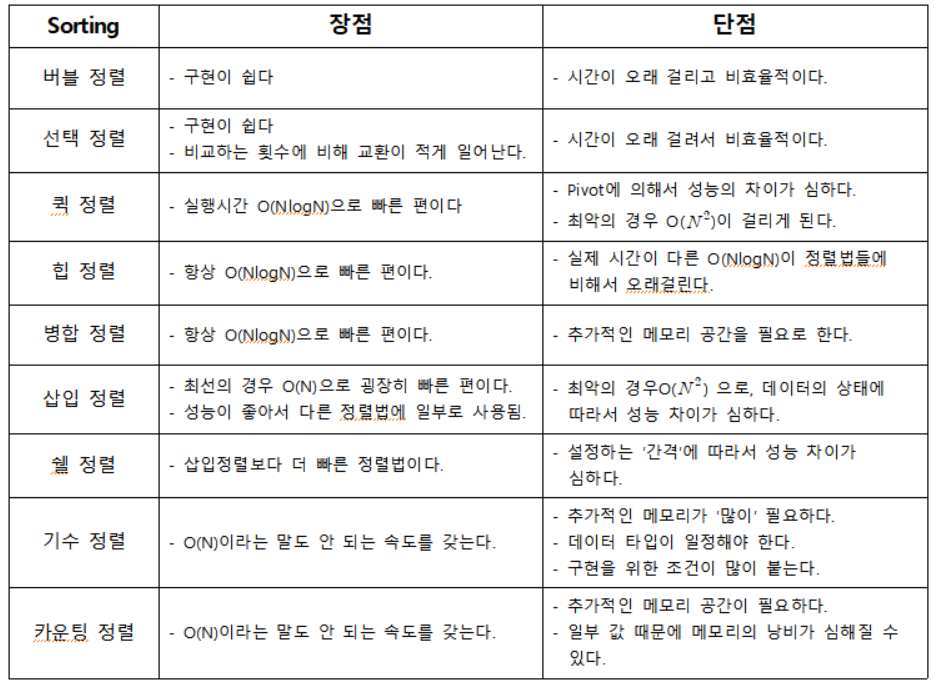

# 정렬 알고리즘

> 시간 복잡도



## 버블 정렬

이웃한 두 원소의 대소 관계를 비교하여 필요에 따라 교환하는 반복 알고리즘.

끝의 인덱스부터 바로 앞의 인덱스의 크기를 서로 비교하여 앞의 인덱스가 더 크면 두 위치를 바꾼다.

```py
def bubble_sort(a : MutableSequence) -> None:
    n = len(a)  # 리스트의 개수
    k = 0
    while k < n-1:
        last = n-1
        for i in range(n-1,k,-1):
            if a[j-1] > a[j]:
                a[j-1],a[j] = a[j],a[j-1]
                last = j    # last는 각 패스에서 마지막으로 교환한 두 원소 중 오른쪽 원소인 a[j]의 인덱스를 의미
        k = last    # 탐색 마치고 나면 k에 last를 넣고 탐색 범위를 제한.
```
## 셰이커 정렬 or 양방향 버블 정렬 or 칵테일 정렬

버블 정렬을 개선한 정렬 방법.

홀수 패스는 가장 작은 원소를 맨 앞으로 이동, 짝수 패스에서는 가장 큰 원소를 맨 뒤로 이동시켜 패스의 스캔방향을 번갈아 하는 방법.

```py
def Shaker_sort(a:MutableSequence) -> None:
    left = 0
    right = len(a) -1    # a는 배열
    last = right

    while left < right:  
        for j in range(right, left,-1): # 큰값부터 정렬
            if a[j - 1] > a[j]:
                a[j - 1], a[j] = a[j],a[j - 1]
                last = j
        left = last
    
        for j in range(left, right): # 작은값 정렬
            if a[j] > a[j+1]:
                a[j], a[j+1] = a[j+1], a[j]
                last = j
        right = last
```

## 단순 선택 정렬

가장 작은 원소부터 선택해 알맞은 위치로 옮기는 작업을 반복하는 단순 정렬 알고리즘.

가장 작은 원소부터 시작해서 큰값과 위치를 바꿔가며 정렬.

서로 이웃하지 않는 떨어져 있는 원소를 교환하기 때문에 안정적이지 않다.

```py

def selection_sort(a:MutableSequence) -> None:
    n = len(a)
    for i in range(n-1):
        min = i # i를 최소값으로 설정
        for j in range(i+1, n):
            if a[j] < a[min]:
                min = j # 더 작은값 발견하면 바꿔준다
        a[i],a[min] = a[min],a[i]
```

## 단순 삽입 정렬

주목한 원소보다 더 앞쪽에서 알맞은 위치로 삽입하여 정렬하는 알고리즘.
## 퀵 정렬

가장 빠른 정렬 알고리즘

검색의 기준점인 피벗(pivot)을 활용하는 알고리즘.

배열을 우측과 좌측으로 나눠서 
```py
def quickSort(a, start, end):
    if start < end:
        left = start
        pivot = bucket[end]
        for i in range(start,end):
            if bucket[i] < pivot:
                a[i], a[left] = a[left], a[i]
                left += 1
        a[left], a[end] = a[end], a[left]
        quickSort(a, start, left-1)
        quickSort(a, left+1, end)
quickSort(bucket, 0, len(bucket)-1)

for i in bucket:
    print(i)
```


## 병합 정렬

병합 정렬은 메모리를 굉장히 많이 차지함.

```py
def megaSort(bucket):
    if len(bucket) > 1:
        mid = len(bucket) // 2
        lbucket, rbucket = bucket[:mid],bucket[mid:]
        megaSort(lbucket)
        megaSort(rbucket)
        li, ri, i = 0,0,0
        while li < len(lbucket) and ri < len(rbucket):
            if lbucket[li] < rbucket[ri]:
                bucket[i] = lbucket[li]
                li += 1
            else:
                bucket[i] = rbucket[ri]
                ri += 1
            i += 1
        bucket[i:] = lbucket[li:] if li != len(lbucket) else rbucket[ri:]

megaSort(bucket)

for i in bucket:
    print(i)
```

## 도수 정렬

```py
def fsort(a, max) -> None:
    n = len(bucket)
    f = [0] * (max + 1)
    b = [0] * n

    for i in range(n):  f[a[i]] += 1
    for i in range(1,max+1):    f[i] += f[i-1]
    for i in range(n-1,-1,-1):  f[a[i]] -= 1; b[f[a[i]]] = a[i]
    for i in range(n):  a[i] = b[i]
```