# 3주차 알고리즘 풀이 이론


# 트리(Tree) 구조

트리(Tree)란? Node와 Branch를 이용해서, 사이클을 이루지 않도록 구성한 데이터 구조

트리 중 이진 트리(Binary Tree) 형태의 구조로, 탐색(검색) 알고리즘 구현을 위해 많이 사용된다.

> 용어

* Node : 트리에서 데이터를 저장하는 기본 요소( 데이터와 다른 연결된 노드에 대한 Branch 정보도 포함)
* Root Node : 트리 맨 위에 있는 노드
* Level : 최상위 노드를 Level 0으로 하였을 때, 하위 Branch로 연결된 노드의 깊이를 나타낸다.
* Parent Node : 어떤 노도의 다음 레벨에 연결된 노드
* Child Node : 어떤 노드의 상위 레벨에 연결된 노드
* Leaf Node : Child Node가 하나도 없는 노드
* Sibling (Brother Node) : 동일한 Parent Node를 가지는 노드
* Depth : 트리에서 Node가 가질 수 있는 최대 Level

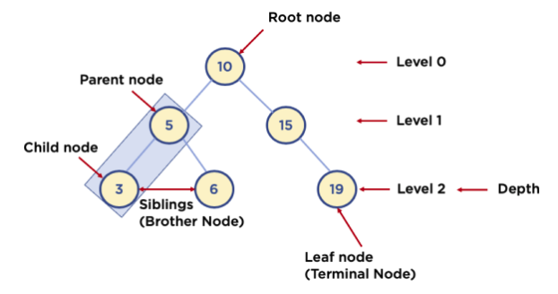

---

## 이진 트리와 이진 탐색 트리(Binary Search Tree)

* 이진 트리 : 노드의 최대 Branch가 2인 트리
* 이진 탐색 트리(Binary Search Tree, BST) : 이진 트리에 다음과 같은 추가적인 조건이 있는 트리
    
    * 왼쪽 노드는 해당 노드보다 작은 값, 오른쪽 노드는 해당 노드보다 큰 값을 가지고 있음!


(출처: www.mathwarehouse.com)


# 트리 순회(Tree Traversal)

순회(Traversal) 란 트리 또는 그래프 같은 연결된 구조에서 객체(노드)를 방문하는 데 사용되는 알고리즘이다. 

순회 문제는 모든 노드를 방문하는 방법을 찾거나 특정 노드만 방문하는 방법을 찾는 것일 수 도있다.

---
### 1. 깊이 우선 탐색

깊이 우선 탐색 (depth-first search, DFS) 란 그래프 또는 트리에서 깊이를 우선하여 탐색하는 알고리즘이다. 

그래프의 경우는 방문한 노드를 표시해야 하는데, 왜냐하면 그렇게 하지 않는다면 무한 반복에 빠질 수 있기 때문이다.

시간 복잡도는 O(V+E) 이다. V는 도달할 수 있는 노드 수 (vertext), E는 도달한 노드에서 나가는 간선 수 (edge) 다.

깊이 우선 탐색은 후입선출 (LIFO) 구조의 스택을 사용하여 구현한다. 

깊이 우선 탐색의 세 가지 경우를 알아보자.

> 1.1 전위 순회

전위 순회 (pre-order traversal) 는 루트 노드 -> 왼쪽 노드 -> 오른쪽 노드 순으로 방문한다. 아래 그림의 노드 위의 숫자가 방문한 순서이다.

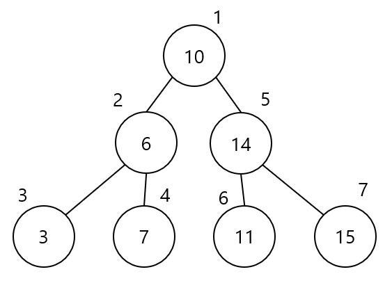

코드로 구현하면 다음과 같다.

```py
def preorder(root):
    if root != 0:
        yield root.value
        preorder(root.left)
        preorder(root.right)
```

> 1.2 후위 순회

후위 순회 (post-order traversal) 는 왼쪽 노드 -> 오른쪽 노드 -> 루트 노드 순으로 방문한다.


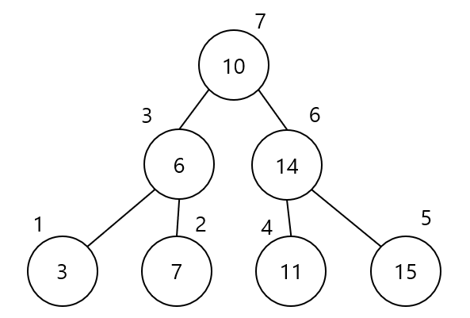

```py
def postorder(root):
    if root != 0:
        postorder(root.left)
        postorder(root.right)
        yield root.value
```

> 1.3 중위 순회

중위 순회 (in-order traversal) 는 왼쪽 노드 -> 루트 노드 -> 오른쪽 노드 순으로 방문한다.

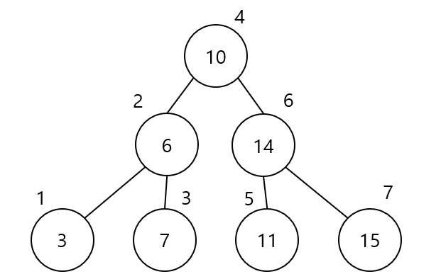


```py
def inorder(root):
    if root != 0:
        inorder(root.left)
        yield root.value
        inorder(root.right)
```
---
# Union-Find알고리즘

## Union-Find 란?

Union-Find 란` Disjoint set`을 구현할 때 사용하는 독특한 형태의 자료구조이다.

한마디로 `공통 원소가 없는 상호 배타적인 부분 집합 들로 나눠진 원소들에 대한 정보를 저장하고 조작하는 자료구조` 이다.

또한 이와 같이 불리는 이유는 초기화 과정과 다음의 두 가지 연산을 지원해야 하기 때문이다.

또한 크루스칼 알고리즘에서 그래프의 최소 신장 트리(MST)를 찾는데 활용된다. (정점 연결 및 사이클 형성 여부 확인)

> Union-Find 지원 연산

* 초기화 : N 개의 원소가 각각의 집합에 포함되어 있도록 초기화 한다.

* union(parent, x, y)
    * 합하기, 연결하기
    * x가 속한 집합과 y가 속한 집합을 합친다. 즉, x와 y가 속한 두 집합을 합치는 연산.


* Find (찾기) 연산 : 어떤 원소 a 가 주어질 때, 이 원소가 속한 집합을 반환한다.
    * 찾기 (속한 그룹 찾기 = 부모 찾기)
    * x가 속한 집합의 대표값(루트 노드 값)을 반환한다. 즉, x가 어떤 집합에 속해 있는지 찾는 연산.


## Union - Find의 구현

Union - Find의 실제 구현은 주로 트리구조를 이용한다. 이유가 있는데 이제 알아보자.

> 배열로 표현시 Union-Find의 지원 연산

가장 간단한 방법인 1차원 배열로 집합을 표현해보자.

```py
# Ex
Array[i] # i번 원소가 속하는 집합의 인덱스 번호를 의미함
```

* 초기화 :  와 같이 각자 다른 집합 번호로 초기화 해준다

* Union (합치기) 연산 : 두 집합을 합치기 위해 배열의 모든 원소를 순회 하면서 하나의 집합 번호를 나머지 한개의 집합 번호로 교체한다. 아래의 그림은 3번 집합을 2번 집합으로 합치는 과정이다. 

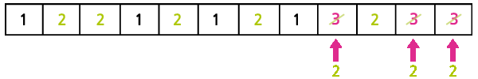

* Find (찾기) 연산 : 한 번만에 원소가 속하는 집합 번호를 알 수 있다.(O(1))

그러나 이 과정에서 배열끼리 `합치는 연산(Union)`을 진행하면 시간 복잡도가 O(N)이 나오기 때문에 그다지 효율적이라고 보기 힘들다.

## 트리로 표현

트리 구조로 Union-Find를 구현하면 배열보다 빠르게 Union연산을 수행할 수 있다.

> Base 1

한 집합에 속하는 원소들을 하나의 트리로 묶어주기 때문에, 자료구조는 아래 그림과 같이 트리 들의 집합으로 표현된다.

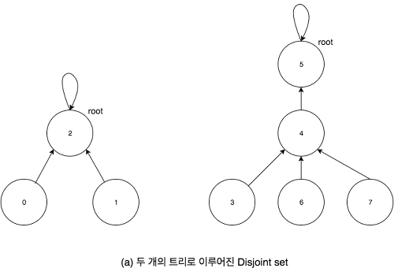

> Base 2

트리 구조 에는 트리의 대표 노드 라고도 볼 수 있는 루트 노드 가 존재 하므로, 각 원소가 속하는 집합 번호를 바로 이 루트 노드의 원소로 정한다.

> Base 3

Union 연산을 수행하기 위해서는 두 원소가 같은 집합에 속하는지를 먼저 확인한 후, 다른 집합에 속할 때만 합쳐야 합니다.

같은 집합에 속한다는 뜻은, `같은 루트 노드를 가진다`는 말과 대응되므로 어떤 원소의 루트 노드 를 찾는 Find 연산을 지원해야한다.

> Base 4

이러한 Find 연산을 지원하기 위해서 모든 자식 노드가 부모에 대한 포인터 정보를 가지고 있도록 한다.

이러한 설정은 가진 정보를 바탕으로 포인터를 따라가 결과적으로 최종 부모인 루트 노드 가 무었인지 찾을 수 있게된다.

단, 부모 노드에서 자식 노드로 내려가는 일은 발생하지 않기 때문에, 부모가 자식에 대한 포인터 정보는 가질 필요가 없다.

> Tree 구조 활용한 Union-Find 지원 연산

* 초기화 : 모두 각자 다른 집합이 된다. 각 노드는 모두 루트 노드 가 되며 N 개의 루트 노드를 생성하고 자기 자신을 가리키는 포인터를 가지도록 설정한다.

* Union (합치기) 연산 : 각 트리의 루트를 찾은 뒤, 다르다면 하나를 다른 한쪽의 자손으로 넣어 두 트리를 합친다.


* Find (찾기) 연산: 각 노드에 저장된 포인터 정보를 따라가 주어진 원소가 포함된 트리의 루트 노드를 찾는다. ( 트리의 높이와 시간복잡도가 비례 )


## 최적화된 Uion-Find 알고리즘

기본적인 Union-Find 알고리즘은 다음의 경우들과 같은 최악의 경우들에서는 상당히 비효율적인 성능을 보여준다.
    
    * 트리 구조가 완전 비대칭인 경우
    * 연결리스트 형태
    * 트리의 높이가 최대가 된다.
    * 원소의 개수가 N일 때, 트리의 높이는 N-1이므로 union()과 find() 함수의 시간복잡도는 모두 O(N)이 된다.
    * 배열로 구현하는 것보다 비효율적이다.

그렇기 때문에 우리는 좀 더 효율적인 union-find 알고리즘을 구현해야 한다.

> 경로 압축(find 최적화)

```Py
parents = [i for i in range(MAX_SIZE)]

def find(parent, x):
    if parent[x] == x:
        return x
    # 경로 압축(Path Compression)
    # find 하면서 만나는 모든 값의 부모 노드를 root로 만듦.
    parent[x] = find(parent, parent[x])
    return parent[x]
```
O(logN) 정도로 시간복잡도 효율이 좋다.

> union 최적화 (union-by-rank(=height))

```py
parents = [i for i in range(MAX_SIZE)]
rank = [0 for _ in range(MAX_SIZE)]


# find()는 위와 동일
def union(parent, x, y, rank):
    rootX = find(parent, x)
    rootY = find(parent, y)

    # 두 값의 root가 같으면(이미 같은 트리) 연결 X(합치지 않음)
    if rootX == rootY:
        return

    # union-by-rank 최적화
    # 항상 높이가 더 낮은 트리를 높이가 높은 트리 밑에 넣음.
    # --> 높이가 더 높은 쪽을 root로 함.
    if rank[rootX] < rank[rootY]:
        parent[rootX] = rootY
    else:
        parent[rootY] = rootX
        if rank[rootX] == rank[rootY]:
            rank[rootX] += 1    # 만약 높이가 같다면 합친 후 -> x 높이 + 1

```

---
# 크루스칼 알고리즘(Kruskal Algorithm)

신장 트리 중에서 최소 비용으로 만들 수 있는 신장 트리를 찾는 알고리즘을 '최소 신장 트리 알고리즘'이라고 한다.

대표적으로 최소 신장 트리 알고리즘으로 크루스칼 알고리즘이 있다.

## 신장 트리란?

그렇다면 신장 트리란 무엇을 의미하는가?

하나의 그래프가 있을 때 모든 노드를 포함하면서 사이클이 존재하지 않는 부분 그래프를 의미한다. -> 이때 `모든 노드가 포함되어 서로 연결되면서 사이클은 존재하지 않는다`는 조건은 트리의 성립 조건이기도 하다.

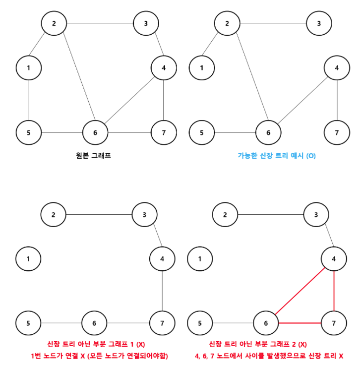

> 그렇다면 최소 신장 트리(Minimum Spanning Tree)란?

크루스칼 알고리즘은 신장 트리 중에서도 최소한의 비용으로 만들 수 있는 최소 신장 트리를 찾는 알고리즘이다.

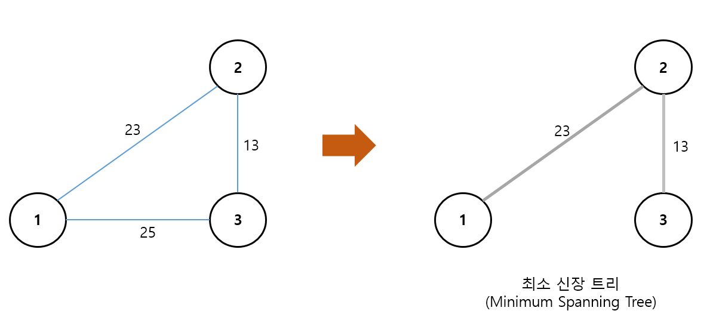


## 크루스칼 알고리즘의 동작 과정

크루스칼 알고리즘의 구체적인 동작 과정은 다음과 같다.

1. 간선 데이터를 비용에 따라 오름차순으로 정렬한다.
2. 간선을 하나씩 확인하며 현재의 간선이 사이클을 발생시키는지 확인한다.

    ① 사이클이 발생하지 않는 경우 최소 신장 트리에 포함시킨다.
    
    ② 사이클이 발생하는 경우 최소 신장 트리에 포함시키지 않는다. (X)

3. 모든 간선에 대하여 2번의 과정을 반복한다.

## 동작 과정

>step 0

그래프의 모든 간선 정보만 따로 빼내어 정렬을 수행한다.

(원래는 비용을 기준으로 오름차순 정렬을 한다.--> 최소한의 비용으로 MST를 만들기 위해서이다.)

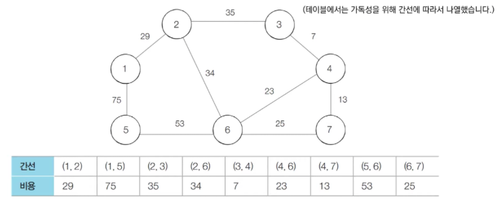

>step 1

비용이 가장 최소인 (3, 4)를 선택한 후 3번 노드와 4번 노드에 대하여 union 함수를 수행한다.

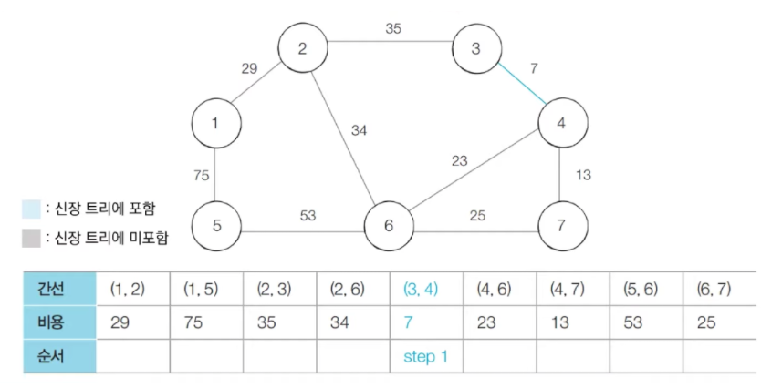

>step 2

방문하지 않은 간선들 중에서 가장 최소인 (4, 7)을 선택하여 처리한다.

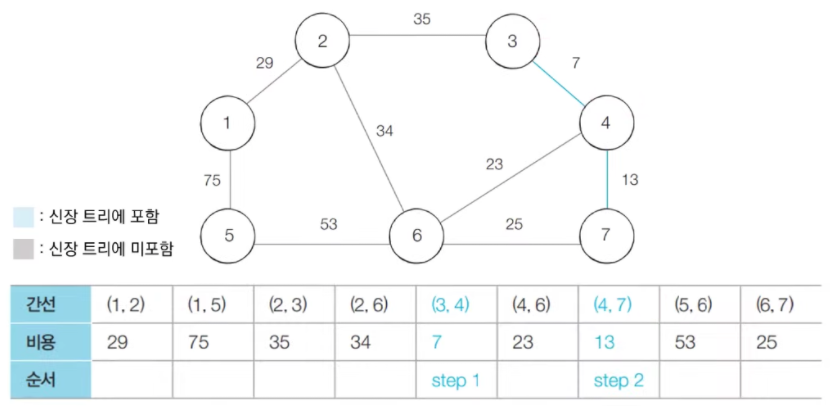

>step 3

방문하지 않은 간선들 중에서 가장 최소인 (4, 6)을 선택하여 처리한다.

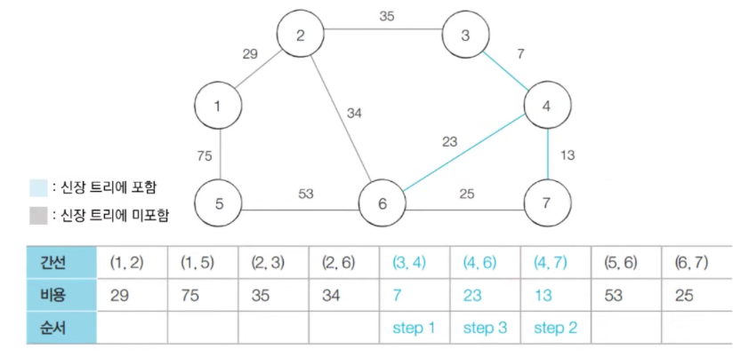

>step 4

방문하지 않은 간선들 중에서 가장 최소인 (6, 7)을 선택하여 처리한다. 

하지만 (6, 7)을 방문할 경우(연결할 경우(=union() 함수)) 사이클이 발생하므로 (6, 7) 간선을 연결하지 않는다.

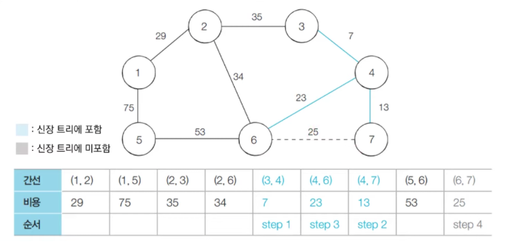

>step 5

방문하지 않은 간선들 중에서 가장 최소인 (1, 2)을 선택하여 처리한다.

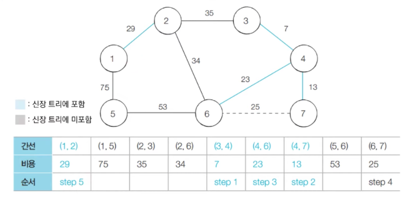

>step 6

방문하지 않은 간선들 중에서 가장 최소인 (2, 6)을 선택하여 처리한다.

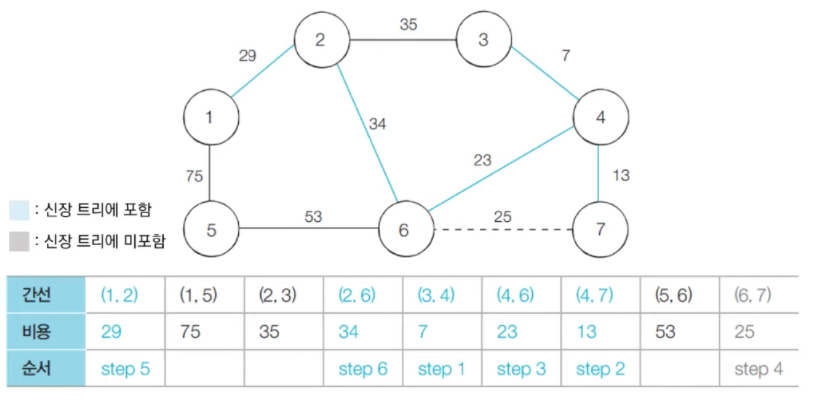

>step 7

방문하지 않은 간선들 중에서 가장 최소인 (2, 3)을 선택하여 처리한다. 

하지만, (2, 3)을 연결할 경우에도 사이클이 발생하므로 연결하지 않는다.

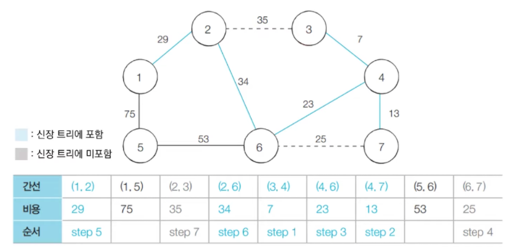

>step 8

방문하지 않은 간선들 중에서 가장 최소인 (5, 6)을 선택하여 처리한다.

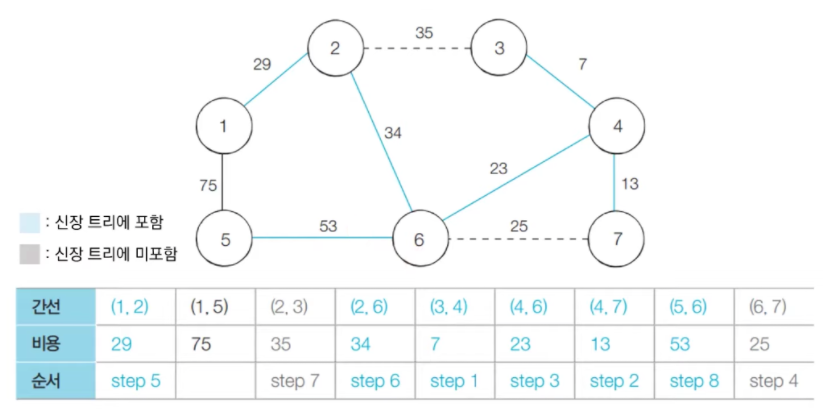

>step 9

방문하지 않은 간선들 중에서 가장 최소인 (1, 5)을 선택하여 처리한다. 

마찬가지로 (1, 5)를 연결하면 사이클이 발생하므로 연결하지 않는다.

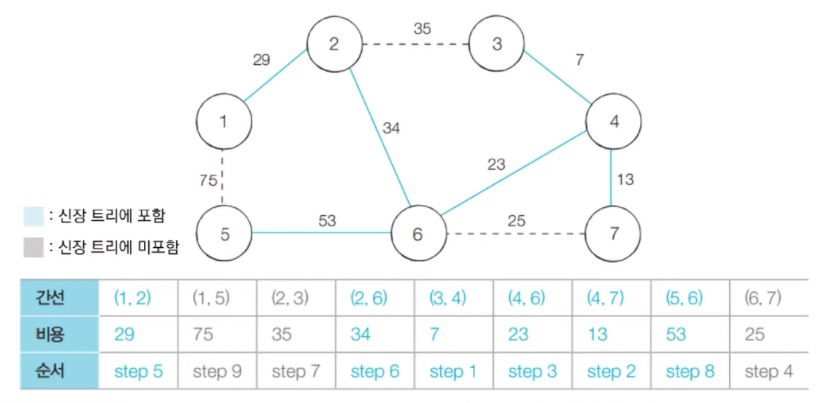

>step Fianl

최종 결과는 다음과 같다.

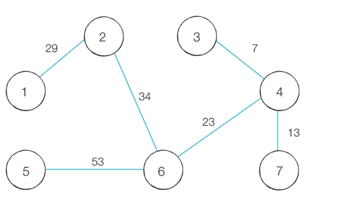

이제 완성된 최소 신장트리에 포함되어 있는 간선의 비용만 모두 더하면, 그 값이 최종 비용에 해당한다. 위 예시의 경우 159가 최종 비용이 되는 것이다.

## 크루스칼 알고리즘 코드(in Python)

크루스칼 알고리즘으로 코드를 구현할 때, 앞서 배운 Union-find 알고리즘을 사용한다.

```py
# 특정 원소가 속한 집합을 찾기
def find(parent, x):
    if parent[x] == x:
        return x
    parent[x] = find(parent, parent[x])
    return parent[x]


# 두 원소가 속한 집합을 합치기 (간선 연결한다고 생각!)
def union(parent, a, b):
    rootA = find(parent, a)
    rootB = find(parent, b)

    if rootA < rootB:
        parent[rootB] = rootA
    else:
        parent[rootA] = rootB


import sys

input = sys.stdin.readline
# 노드의 개수와 간선(union 연산)의 개수 입력받기
v, e = map(int, input().split())
parent = [0] * (v + 1)

edges = []
result = 0

# 부모 테이블상에서, 부모를 자기 자신으로 초기화
for i in range(1, v + 1):
    parent[i] = i

# 모든 간선에 대한 정보를 입력받기
for _ in range(e):
    a, b, cost = map(int, input().split())
    # 비용순으로 오름차순 정렬하기 위해 튜플의 첫 번째 원소를 비용으로 설정
    edges.append((cost, a, b))

edges.sort()

for edge in edges:
    cost, a, b = edge
    # 사이클이 발생하지 않는 경우에만 집합에 포함(=연결한다.)
    if find(parent, a) != find(parent, b):
        union(parent, a, b)
        result += cost

print(result)

# sample input
# 7 9
# 1 2 29
# 1 6 75
# 2 3 35
# 2 6 34
# 3 4 7
# 4 6 23
# 4 7 13
# 5 6 53
# 6 7 25
```
